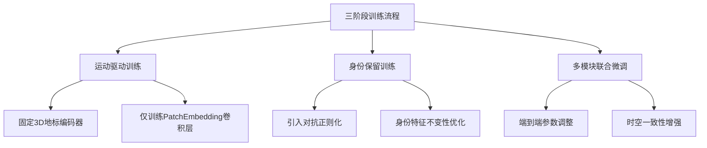

# SkyReels-A1: Expressive Portrait Animation in Video Diffusion Transformers

## 1. 核心贡献
- **创新框架**
  - 基于视频扩散变换器（DiT）架构  
  - 动态条件模块（表情地标 + 跨模态对齐）  
- **训练方法**  
  - 分阶段训练策略：运动→身份→多模块联合优化  
- **技术突破**  
  - 支持多样化身体比例  
  - 高保真表情/动作迁移  

## 2. 方法论
### 2.1 基础架构
- **扩散模型**  
  - 3D VAE潜在空间映射  
  - 时空自注意力机制  
- **条件控制**  
  - 文本嵌入（T5编码器）  
  - 图像条件（特征提取器）  

### 2.2 关键技术模块
- **3D表情地标系统**  
  - 神经渲染增强的3D关键点  
  - 解决2D地标对齐问题  
- **时空对齐地标引导**  
  - 3D因果编码器  
  - 共享潜在空间投影  
- **面部图像-文本对齐**  
  - SigLip视觉编码器  
  - 轻量级MLP映射层  

## 3. 训练策略

## 4. 技术优势
| 维度 | 传统方法 | SkyReels-A1突破 |
|------|----------|-----------------|
| 身份一致性 | 依赖显式特征变形 | 潜在空间联合建模 |
| 运动控制 | 2D骨架/地标 | 高精度3D神经渲染地标 |
| 身体适配 | 局限于头部 | 全身比例自适应 |
| 训练效率 | 端到端单阶段 | 渐进式多阶段优化 |

## 5. 应用场景
* 虚拟化身生成
* 实时视频编辑
* 数字内容创作
* 增强视频会议

## 6. 未来方向
1. 实时推理优化
2. 多模态驱动扩展（语音+手势）
3. 跨风格迁移能力增强